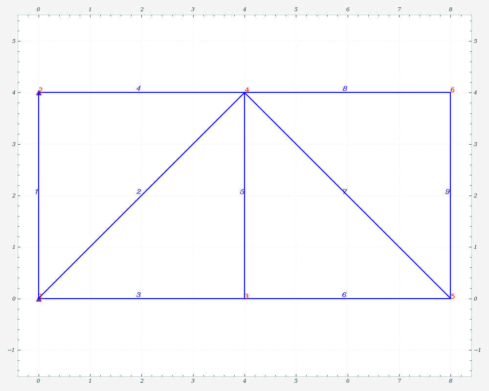
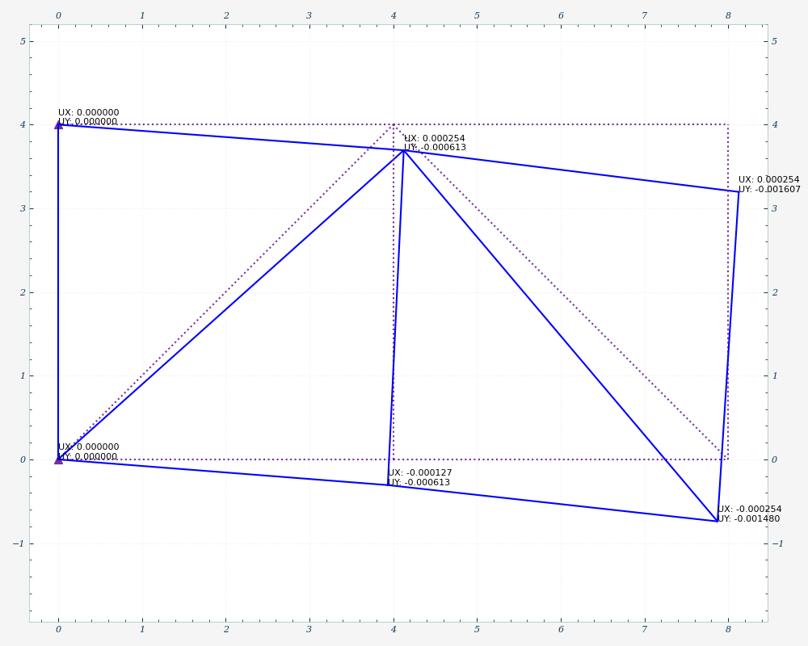
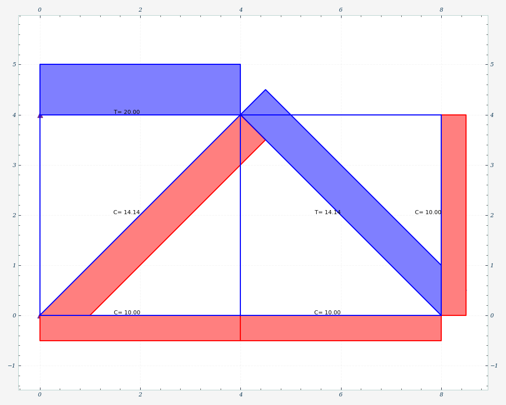
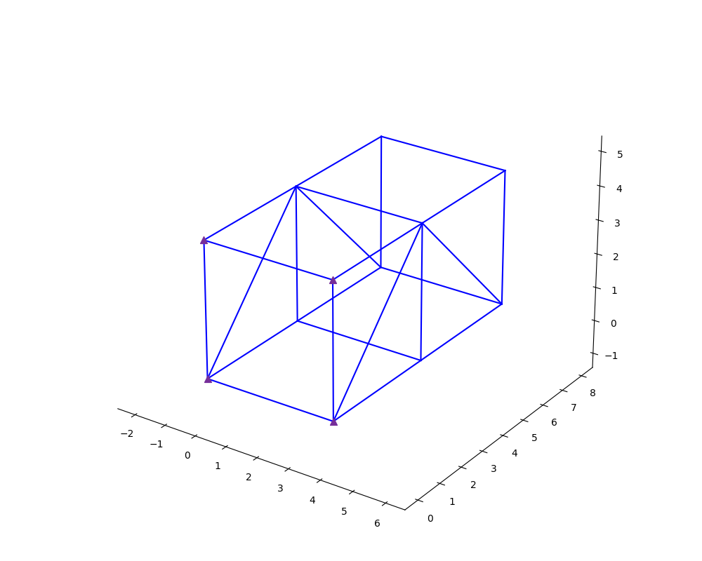
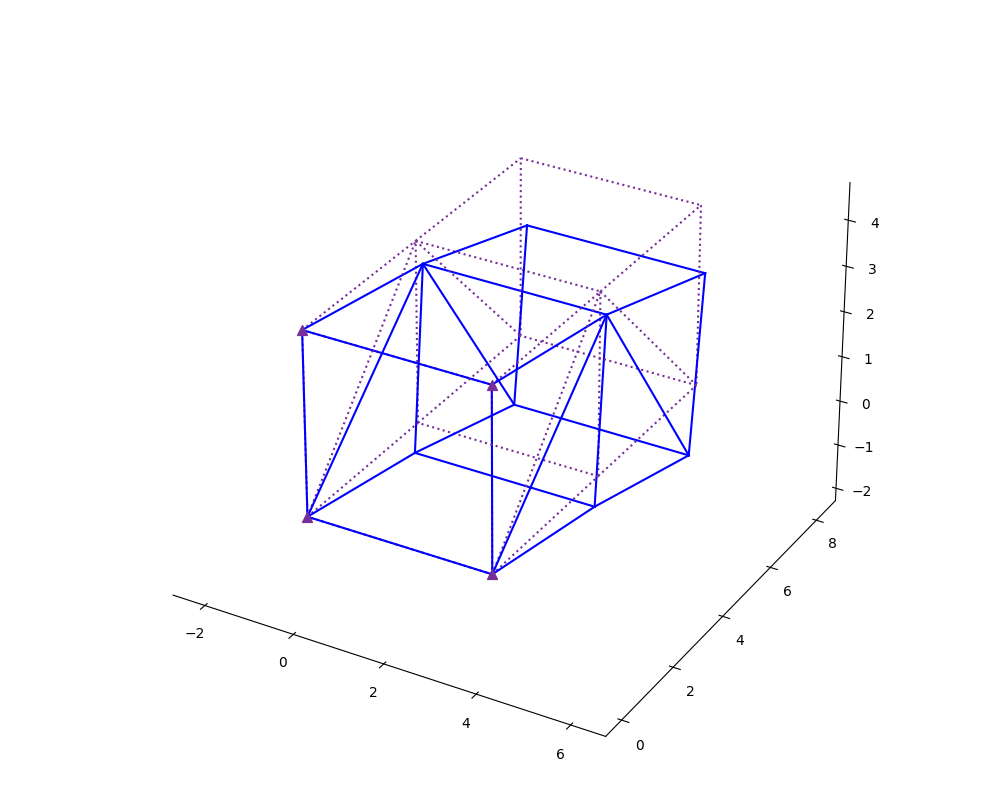

# Milcatrusspy

## instalacion

```bash
pip install milcatrusspy
```

## Capacidad de la libreria

- [x] Creacion de nodos (2D y 3D)
- [x] Creacion de elementos articulados (armadura) (2D y 3D)
- [x] Aplicacion de cargas (2D y 3D)
- [x] Aplicacion de restringimientos (2D y 3D)
- [x] Resolucion de la estructura (2D y 3D)
- [x] Impresion de resultados (2D y 3D)
- [x] Graficacion de la estructura (2D y 3D)
- [x] Graficacion de la estructura deformada (2D y 3D)
- [x] Graficacion de las fuerzas (2D y 3D)
- [x] Graficacion de las reacciones (2D y 3D)
- [x] Obtener resultados (2D y 3D)

## Comandos de uso en 2D

### Metodos de la clase Model

Creacion del modelo

```python
model = Model(ndm: int=2)
```

Creacion de nodos

```python
model.add_node(tag: int, x: float, y: float)
```

Creacion de elementos articulados (armadura)

```python
model.add_element(tag: int, tag_node_i: int, tag_node_j: int, E: float, A: float)
```

Aplicacion de cargas

```python
model.set_load(tag_node: int, fx: float, fy: float)
```

Aplicacion de restringimientos

```python
model.set_restraints(tag_node: int, ux: bool, uy: bool)
```

Resolucion de la estructura

```python
model.solve()
```

Impresion de resultados

```python
model.print_results()
```

Obtener resultados

```python
nodes, elements = model.get_results()
```

Graficacion de la estructura

```python
model.plot_model(labels: bool)
```

Graficacion de la estructura deformada

```python
model.plot_deformed(scale: float, labels: bool)
```

Graficacion de las fuerzas

```python
model.plot_axial_forces(scale: float, labels: bool)
```

Graficacion de las reacciones

```python
model.plot_reactions()
```

### Ejemplo de uso en 2D

```python
from milcatrusspy import Model

model = Model(ndm=2)
model.add_node(tag=1, x=0, y=0)
model.add_node(tag=2, x=0, y=4)
model.add_node(tag=3, x=4, y=0)
model.add_node(tag=4, x=4, y=4)
model.add_node(tag=5, x=8, y=0)
model.add_node(tag=6, x=8, y=4)
model.add_element(tag=1, tag_node_i=1, tag_node_j=2, E=2.1e6, A=0.3*0.5)
model.add_element(tag=2, tag_node_i=1, tag_node_j=4, E=2.1e6, A=0.3*0.5)
model.add_element(tag=3, tag_node_i=1, tag_node_j=3, E=2.1e6, A=0.3*0.5)
model.add_element(tag=4, tag_node_i=2, tag_node_j=4, E=2.1e6, A=0.3*0.5)
model.add_element(tag=5, tag_node_i=3, tag_node_j=4, E=2.1e6, A=0.3*0.5)
model.add_element(tag=6, tag_node_i=3, tag_node_j=5, E=2.1e6, A=0.3*0.5)
model.add_element(tag=7, tag_node_i=4, tag_node_j=5, E=2.1e6, A=0.3*0.5)
model.add_element(tag=8, tag_node_i=4, tag_node_j=6, E=2.1e6, A=0.3*0.5)
model.add_element(tag=9, tag_node_i=5, tag_node_j=6, E=2.1e6, A=0.3*0.5)
model.set_restraints(tag_node=1, ux=True, uy=True)
model.set_restraints(tag_node=2, ux=True, uy=True)
model.set_load(tag_node=6, fy=-10)
model.solve()
nodes, elements = model.get_results()
model.print_results()
model.plot_model(labels=True)
model.plot_deformed(scale=500, labels=False)
model.plot_axial_forces(scale=0.05, labels=False)
model.plot_reactions()
```

### Resultados del ploteo





## Comandos de uso en 3D

### Metodos de la clase Model

Creacion del modelo

```python
model = Model(ndm: int=3)
```

Creacion de nodos

```python
model.add_node(tag: int, x: float, y: float, z: float)
```

Creacion de elementos articulados (armadura)

```python
model.add_element(tag: int, tag_node_i: int, tag_node_j: int, E: float, A: float)
```

Aplicacion de cargas

```python
model.set_load(tag_node: int, fx: float, fy: float, fz: float)
```

Aplicacion de restringimientos

```python
model.set_restraints(tag_node: int, ux: bool, uy: bool, uz: bool)
```

Resolucion de la estructura

```python
model.solve()
```

Impresion de resultados

```python
model.print_results()
```

Obtener resultados

```python
nodes, elements = model.get_results()
```

Graficacion de la estructura

```python
model.plot_model(labels: bool)
```

Graficacion de la estructura deformada

```python
model.plot_deformed(scale: float, labels: bool)
```

Graficacion de las fuerzas

```python
model.plot_axial_forces(scale: float, labels: bool)
```

Graficacion de las reacciones

```python
model.plot_reactions()
```

### Ejemplo de uso en 3D

```python
from milcatrusspy import Model

cercha = Model()

nodes = [
    [1, 0, 0, 0],
    [2, 0, 0, 4],
    [3, 4, 0, 4],
    [4, 4, 0, 0],
    [5, 0, 4, 0],
    [6, 0, 4, 4],
    [7, 4, 4, 4],
    [8, 4, 4, 0],
    [9, 0, 8, 0],
    [10, 0, 8, 4],
    [11, 4, 8, 4],
    [12, 4, 8, 0]
]

elements = [
    [1, 1, 2, 2100000.0, 0.15],
    [2, 2, 3, 2100000.0, 0.15],
    [3, 3, 4, 2100000.0, 0.15],
    [4, 4, 1, 2100000.0, 0.15],
    [5, 5, 6, 2100000.0, 0.15],
    [6, 6, 7, 2100000.0, 0.15],
    [7, 7, 8, 2100000.0, 0.15],
    [8, 8, 5, 2100000.0, 0.15],
    [9, 9, 10, 2100000.0, 0.15],
    [10, 10, 11, 2100000.0, 0.15],
    [11, 11, 12, 2100000.0, 0.15],
    [12, 12, 9, 2100000.0, 0.15],
    [13, 1, 5, 2100000.0, 0.15],
    [14, 2, 6, 2100000.0, 0.15],
    [15, 3, 7, 2100000.0, 0.15],
    [16, 4, 8, 2100000.0, 0.15],
    [17, 5, 9, 2100000.0, 0.15],
    [18, 6, 10, 2100000.0, 0.15],
    [19, 7, 11, 2100000.0, 0.15],
    [20, 8, 12, 2100000.0, 0.15],
    [21, 1, 6, 2100000.0, 0.15],
    [22, 4, 7, 2100000.0, 0.15],
    [23, 6, 9, 2100000.0, 0.15],
    [24, 7, 12, 2100000.0, 0.15]
]

for (tag, x, y, z) in nodes:
    cercha.add_node(tag, x, y, z)

for (tag, tag_node_i, tag_node_j, E, A) in elements:
    cercha.add_element(tag, tag_node_i, tag_node_j, E, A)

for i in range(1, 5):
    cercha.set_restraints(i, True, True, True)

cercha.set_load(10, fz=-10)
cercha.set_load(11, fz=-10)

cercha.solve()
nodes, elements = cercha.get_results()
cercha.print_results()
cercha.plot_model(labels=True)
cercha.plot_deformed(scale=500, labels=False)
cercha.plot_axial_forces(0.05, labels=False)
cercha.plot_reactions()
```

### Resultados del ploteo

ploteo de la estructura

ploteo de la estructura deformada

ploteo de las fuerzas (rojo: compresion, azul: traccion)


## Obtener Resultados

```python
nodes, elements = model.get_results()

model.print_results() # Imprime los resultados en la terminal
```

esto imprimira los resultados en la terminal tanto de los nodos como de los elementos
ademas este metodo retorna 2 dataframes con los resultados de los nodos y los elementos respectivamente

en una tabla de la forma:

### Resultados de los Nodos

|     | Node 1 | Node 2 | Node ... | Node n |
| --- | ------ | ------ | -------- | ------ |
| UX  | ...    | ...    | ...      | ...    |
| UY  | ...    | ...    | ...      | ...    |
| UZ  | ...    | ...    | ...      | ...    |

### Resultados de los Elementos

|          | Element 1 | Element 2 | Element ... | Element n |
| -------- | --------- | --------- | ----------- | --------- |
| U1       | ...       | ...       | ...         | ...       |
| U2       | ...       | ...       | ...         | ...       |
| F1       | ...       | ...       | ...         | ...       |
| F2       | ...       | ...       | ...         | ...       |
| Estado   | ...       | ...       | ...         | ...       |
| Longitud | ...       | ...       | ...         | ...       |

## Comprobacion de resultados

### del ejemplo en 3D

|                 | Node 1 | Node 2 | Node 3 | Node 4 | Node 5    | Node 6    | Node 7    | Node 8    | Node 9    | Node 10   | Node 11   | Node 12   |
| --------------- | ------ | ------ | ------ | ------ | --------- | --------- | --------- | --------- | --------- | --------- | --------- | --------- |
| UX_sap2000      | 0      | 0      | 0      | 0      | 0         | 0         | 0         | 0         | 0         | 0         | 0         | 0         |
| UY_sap2000      | 0      | 0      | 0      | 0      | -0.000127 | 0.000254  | 0.000254  | -0.000127 | -0.000254 | 0.000254  | 0.000254  | -0.000254 |
| UZ_sap2000      | 0      | 0      | 0      | 0      | -0.000613 | -0.000613 | -0.000613 | -0.000613 | -0.001480 | -0.001607 | -0.001607 | -0.001480 |
| UX_milcatrusspy | 0      | 0      | 0      | 0      | 0         | 0         | 0         | 0         | 0         | 0         | 0         | 0         |
| UY_milcatrusspy | 0      | 0      | 0      | 0      | -0.000127 | 0.000254  | 0.000254  | -0.000127 | -0.000254 | 0.000254  | 0.000254  | -0.000254 |
| UZ_milcatrusspy | 0      | 0      | 0      | 0      | -0.000613 | -0.000613 | -0.000613 | -0.000613 | -0.001480 | -0.001607 | -0.001607 | -0.001480 |
| %error (UX)     | 0.00%  | 0.00%  | 0.00%  | 0.00%  | 0.00%     | 0.00%     | 0.00%     | 0.00%     | 0.00%     | 0.00%     | 0.00%     | 0.00%     |
| %error (UY)     | 0.00%  | 0.00%  | 0.00%  | 0.00%  | 0.00%     | 0.00%     | 0.00%     | 0.00%     | 0.00%     | 0.00%     | 0.00%     | 0.00%     |
| %error (UZ)     | 0.00%  | 0.00%  | 0.00%  | 0.00%  | 0.00%     | 0.00%     | 0.00%     | 0.00%     | 0.00%     | 0.00%     | 0.00%     | 0.00%     |

### del ejemplo en 2D

|                     | Node 1 | Node 2 | Node 3    | Node 4    | Node 5    | Node 6    |
| ------------------- | ------ | ------ | --------- | --------- | --------- | --------- |
| **UX_sap2000**      | 0      | 0      | 0         | 0         | 0         | 0         |
| **UY_sap2000**      | 0      | 0      | -0.000127 | 0.000254  | -0.000254 | 0.000254  |
| **UZ_sap2000**      | 0      | 0      | -0.000613 | -0.000613 | -0.001480 | -0.001607 |
| **UX_milcatrusspy** | 0      | 0      | 0         | 0         | 0         | 0         |
| **UY_milcatrusspy** | 0      | 0      | -0.000127 | 0.000254  | -0.000254 | 0.000254  |
| **UZ_milcatrusspy** | 0      | 0      | -0.000613 | -0.000613 | -0.001480 | -0.001607 |
| **%error (UX)**     | 0.00%  | 0.00%  | 0.00%     | 0.00%     | 0.00%     | 0.00%     |
| **%error (UY)**     | 0.00%  | 0.00%  | 0.00%     | 0.00%     | 0.00%     | 0.00%     |
| **%error (UZ)**     | 0.00%  | 0.00%  | 0.00%     | 0.00%     | 0.00%     | 0.00%     |
